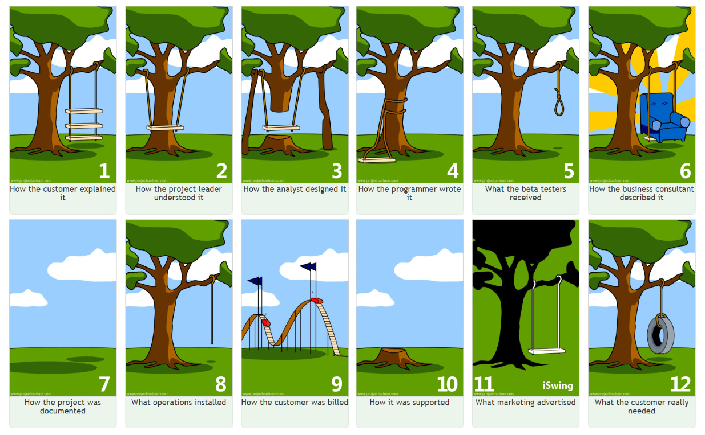
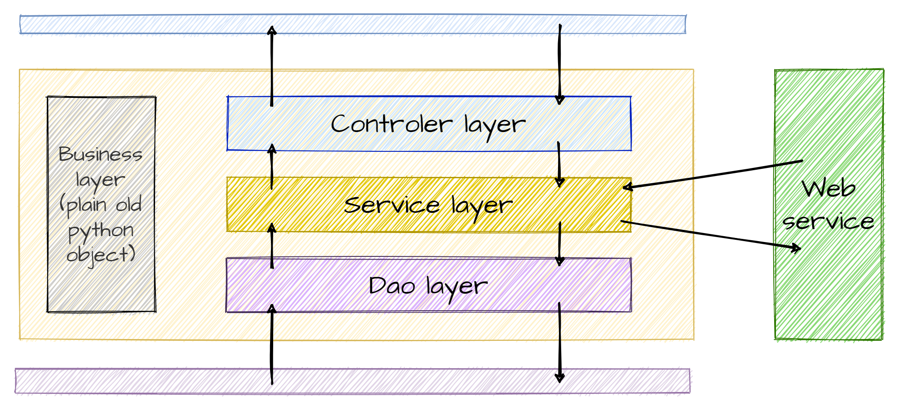

## Outline

1. Functional Analysis
   - Definition
   - UML Diagrams
2. Software Architecture
   - Definition
   - Separation of Responsibilities

:::::: {.hide-html-render}
## Analyse fonctionnelle
<iframe src="https://giphy.com/embed/l0HlQngl0Eja36dlS" width="960" height="540" frameBorder="0" class="giphy-embed no-print" allowFullScreen></iframe>

::: {.notes}
80 % des projets sont un echec (total ou relatif).

Les questions qu'il faut se poser avant de commencer :

- Qu'est ce qu'on fait ? Qui le fait
- Besoins du client
- Fonctionnalités requises / optionnelles / bonus
- Bien gérer les priorités
- Répartition des rôles dans l'équipe

:::
::::::

### Project Phases

- Analysis of the needs (specifications)
- Planning
- Design
- Development
- Testing
- Deployment
- Maintenance

::: {.notes}
In traditional projects (V-Cycle), these phases were highly segmented.
:::

### Project actors

:construction:

- Fonctionnel - Technique
- Besoin Métier
- MOA - MOE
- Etude préalable, budget, temps, qualité - Cahier des charges - SFD - Spec technique - Dossier test
- SCRUM

---

::: {.notes}
- Important de discuter
- Reformulez
- Utilisez des mots simples
- Imaginez que vous expliquez le projet à vos grands parents
- parler doc, arrivée sur poste, initiatives
:::

### What is Functional Analysis?

- First step in all projects
- Determines the functions and actors of the product to meet client needs
- Diagrams to communicate with the client
- Prioritizes tasks

::: {.notes}
- Permet de s'approprier le sujet
- Ce n'est pas du temps perdu car rajouter des fonctionnalités non prévues est extrêmement compliqué
- Cette phase sera la première partie du rapport intermédiaire

coût d'ajout d'une fonctionnalité / coût correction bug

Cost of Change Curve:

- Cahier des charges : 1 €
- Développement : 10 €
- Tests : 50 €
- Production : 100 €
:::

### Questions to Ask

- What types of users will use my application (administrator, manager, client, etc.)?
- What are the features? Common features between profiles?
- How do the application processes work?
- Which diagrams should be used?

::: {.notes}
- Use case diagrams for the first questions
- Activity diagrams for processes
- Why create diagrams? At a glance, you have all the information
  - Comment on your diagrams
:::

### UML Diagrams

- First-year course
- UML 2.5, Pascal Roques, Eyrolles, Memento (ENSAI library)

:::{.callout-note}
It is **agnostic** of the chosen programmation language !

A functional analysis UML diagram is **its own language**.
:::

::: {.notes}
- No time to redo a course
- Resources are available in the library and online
- Ask your tutor what they expect
:::

:::::: {.hide-html-render}
### Questions?

<iframe src="https://giphy.com/embed/TgF6xfH8V0mZcUyneP" width="960" height="540" frameBorder="0" class="giphy-embed no-print" allowFullScreen></iframe>
::::::

## Software Architecture

::: {.notes}
Voila pour les grand principes.

On va maintenant rentrer dans le concret.
:::

### What is Software Architecture?

- The technical counterpart of functional analysis
- Now that we have the who and what, we determine the how
- We design the code of our application
- Macro vision of our application (arrangement of major components)

::: {.notes}
For now, we are not yet writing code.

We will only draft our application with the components it comprises (both logical and physical).

For example, in your case, you will likely have:

- Python code running on your computer
- An external web service providing data
- A PostgreSQL database.

These are already 3 components, but quickly there will be many, and we need to know how to arrange them.
:::

:::::: {.hide-html-render}
### Why It's Important: Parallel with Architecture

::::::

### Why It's Important: Parallel with Architecture

- Rooms, electrical installation, water, gas, legislative constraints, adapting to the terrain...
- Need to think about how to arrange all this from the beginning
- If we build as we go, we risk ending up with an inconsistent house (at best)
- **This is not wasted time!**

::: {.notes}
Some people even say we should spend more time analyzing than coding. This is debatable, but it shows how important the analysis phase (how to code the functions) is!

genAI can almost code for us.
:::

### A Major Principle: Separation of Concerns

::: {.notes}
Macro version in 3 layers.

- Presentation: everything related to display
- Business: the core of your application, its added value
- Data: data storage

Each layer communicates with adjacent layers.

A layer only needs to know how to request information and what is returned.
Not obvious but very important!!!
:::

### Main Layers of an Application

- **_Presentation:_** everything related to display (web page, console, window)
- **_Business:_** the core of your application, its **added value**
- **_Persistence:_** manages data persistence. Database or file system

::: {.notes}
Dans le monde pro :

- Présentation : JavaScript
- Métier : Java / Python
- Persistance : PostgreSQL ou MariaDB
:::

### For Your Project

- **_Presentation:_** Front-end
- **_Business:_** Back-end
- **_Persistence:_** Database

::: {.notes}
Exemple page web
:::

### Zoom sur la couche métier

::: {.notes}
Within the Business layer, there are several sub-layers.

In the practical work:

- Presentation layer: View (navigate between views)
- DAO, business_object, service
- Controller: It receives user requests via the user interface (e.g., an HTTP request in the case of a web application) and calls the appropriate services to execute the requested actions.
:::

### Layers of the Business Layer 1/2

- **_DAO (Data Access Object):_**
  - The part of your code that communicates with the database (Lecture 4/Practical 4)
- **_Service:_**
  - Business code
  - Manipulates business objects to create information or value
  - Requests objects from the DAO layer (Practical 4)
  - Calls external web services (Practical 3)

### Layers of the Business Layer 2/2

- **_Business Objects:_**
  - Transversal layer
  - Represent business concepts that your code will manipulate
  - Objects with mostly attributes and few methods
- **_Controller:_**
  - Retrieves user inputs
  - Returns data to be displayed

::: {.notes}
We break down the objects:

- Attributes -> Business Objects (~DTO)
- Methods -> Services
:::

### Why Separate into Layers?

- Teamwork 🦸‍♀️🧙‍♂️👨‍💼👩‍🔬
- Code readability 📖
- Debugging 🐞

> **Limit the risk of errors when modifying code (avoid spaghetti code) 🍝**

::: {.notes}
Il faut savoir qu'un code doit être lisible par les autres.  
Et les autres, ça peut être soi-même dans 2 mois. Blague sur la relecture de code.  
Si on a un code bien séparé, différentes équipes peuvent travailler en parallèle.  
Et séparer en couches permet de trouver rapidement la source du problème.
:::

### Key Takeaways

- Spending time thinking about the different modules of an application is not a waste of time 🕵️‍♀️
- Dividing into layers allows parallel work 🧪🧫📚
- But we still need to think about how to code well 🤖

::: {.notes}
Possible in the project to distribute the layers.
:::
