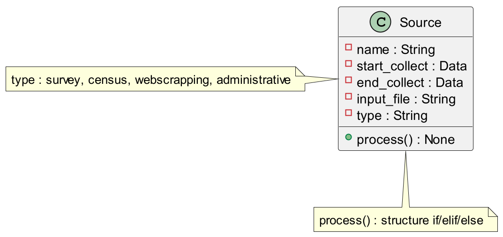
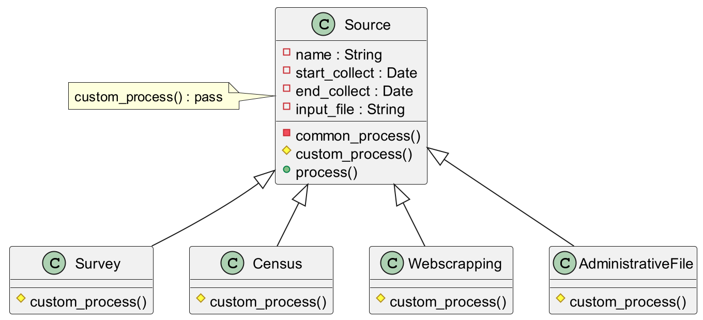
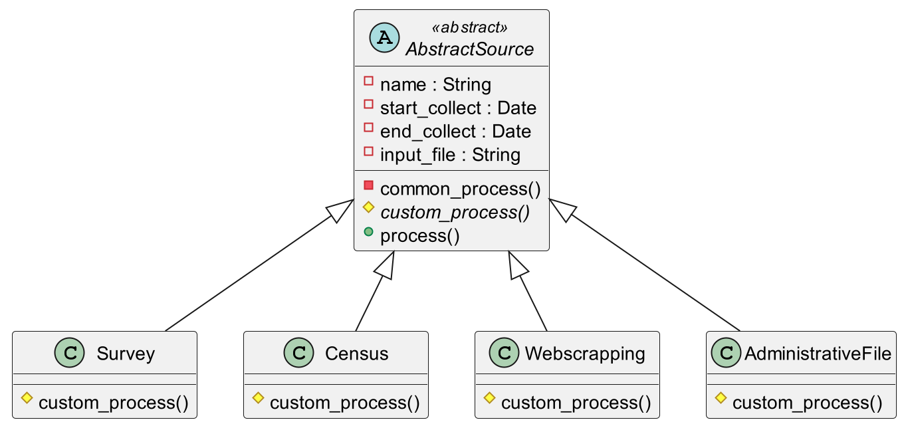
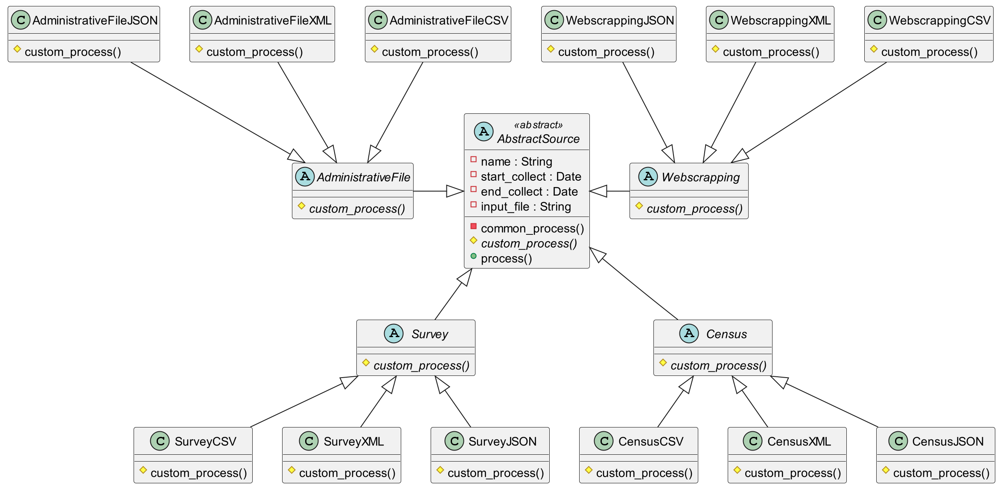
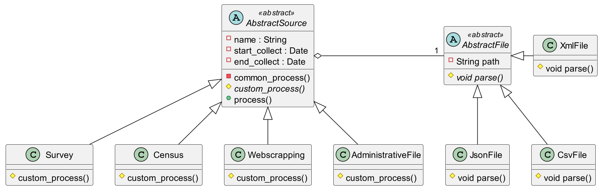
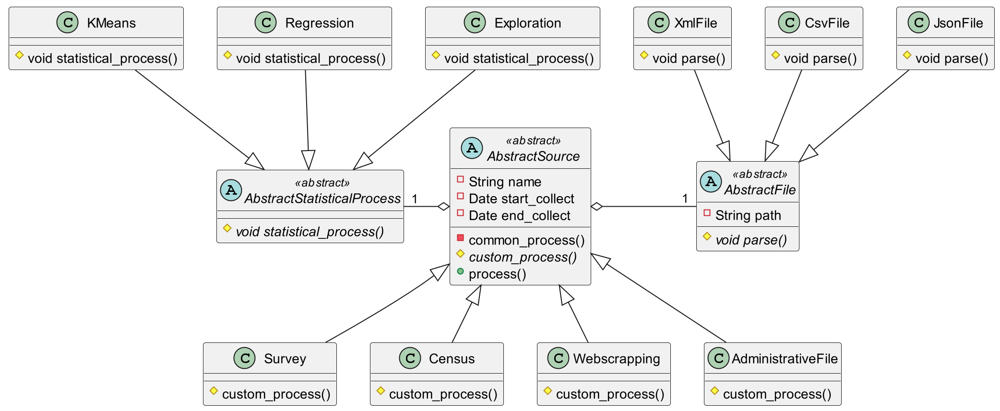

## Outline

1. Advanced OOP Concepts
   - Recap
   - Abstract Classes
   - Bridge Pattern
2. Software Engineering
   - Definition
   - Single Responsibility Principle
   - Design Patterns

## A Few Reminders

The three principles of object-oriented programming:

- **Encapsulation:** an object contains **attributes** and **methods**.
- **Inheritance:** an object can **inherit** attributes and methods from another class to **redefine** them. It can also add other attributes/methods.
- **Polymorphism:** a method can be associated with **different code** depending on the parameters passed or the object it belongs to.

::: {.notes}
Ce sont les trois principes qu'apporte la programmation orientée objet. Ils sont présentés par ordre de "simplicité". La qualité de votre code va dépendre de votre maîtrise et application de ces principes. Cela prend du temps pour bien les comprendre.

- Attribut : ce qu'il est
- Méthode : ce qu'il peut faire
- Héritage : Nouvelles capacités (ex : Médecin -> Chirurgien)
- Polymorphisme : 2 types (liste d'Animal.parler(malade=True))
:::

### An Example to Illustrate
Automatic data processing application:

- Multiple data sources: surveys, web scraping, administrative files, etc.
- Multiple data formats: csv, xml, json, etc. (*we'll come back to this*)
- Multiple processing algorithms: exploratory statistics, regression, "machine learning," etc.

::: {.notes}
Fundamentally, it's a fairly simple application.
:::


### Example of a Class Diagram



::: {.notes}
Voyez-vous des choses à corriger ?  
Est-ce que la méthode *process()* sera la même pour survey et census ?

```{.python}
def process(self):
  if self.type = "census":
    ...
  elif
    ...
```
:::


### An Example with Inheritance



::: {.notes}
La classe `Source` permet de centraliser des attributs communs et de définir des méthodes communes, mais ces méthodes vont être surchargées par les classes filles.  
Grâce au polymorphisme, j'ai un comportement différent mais le code reste clair, avec une partie commune à tous les types de fichiers et une partie spécifique.

Code dans le dossier exemple POO.

Que pensez-vous de la classe Source ?
:::

### Abstract Classes

**Abstract Class:** a class whose implementation is **not complete** and which is **not instantiable**. 

Allows passing a **contract**. Child classes will have to implement what is missing.

**Advantages:**

- We know what child classes must do 👍
- We can generate code 🙏
- Limits the risk of error!! 👌

::: {.notes}
Certains objets n'ont pas besoin d'être implémentés complètement ni de pouvoir être instantiés. Souvent, c'est pour des notions abstraites.  

Rappels : classe, objet, abstrait (Vehicule)
:::

### For Example



::: {.notes}
Pour vous, cela peut sembler marginal comme changement (surtout à cause de Python), mais ce changement permet de manipuler l'abstraction au lieu des implémentations et d'avoir un code propre (vous ferez ça en TP).

`v = Vehicule("rouge")` -> ça marche plus

Méthode *custom_process* abstraite
:::


### And in Python?

- No native support for abstract classes 😱
- Abstract Base Classes (abc) module to solve the problem 🦾
- Already included in your Python distribution 😌
  - **Step 1:** Import the module 🧳
  - **Step 2:** Inherit from `ABC` 👨‍👩‍👧‍👦
  - **Step 3:** Define abstract methods 📝
  - **Step 4:** ???
  - **Step 5:** Profit 💰💰


::: {.notes}
Step 4 : implémenter les méthodes abstraites dans les classes filles

L'autre gros défaut de Python est son typage dynamique.

Python va typer les objets au runtime, et pas au compile time. Cela ne permet pas d'avoir autant d'outils que dans d'autres langages. Mais vous pouvez utiliser les docstrings pour typer vos objets.
:::


### What If We Added Data Formats?

Currently, 3 data formats in our application:

- **CSV:** Comma Separated Values (tabular)
- **XML:** eXtended Markup Language (tag format)
- **JSON:** JavaScript Object Notation (key-value format)

::: {.notes}
On reviendra plus en détail sur les différents formats.

Retour 2 slides avant : si on fait pareil et qu'on utilise l'héritage pour le format
:::


### For Example



Do you see a problem?

::: {.notes}
Ca grossit de manière exponentielle
:::


### The Power of OOP

- Currently 4 * 3 "concrete" classes to define 😱
- Reading the format is dependent on the source 😵

**BUT**

- We can externalize this processing! 😌
- Aggregation relationship 🤯

::: {.notes}
Il faut bien comprendre
:::


### Le bridge pattern




### Work Smart, Not Hard

- **Composition + inheritance:** 9 classes 😎
- **Inheritance:** 17 classes 😫
- We can easily add types and formats 🥳

::: {.callout-important title="Pattern Bridge"}
Découpage d'une grosse classe en un groupe de petites classes avec leur propre hiérarchie qu'il faut ensuite assembler.
:::


### In Summary

- Use the power of OOP 💣
- Prefer specific objects (inheritance) over `if/elif/else` 🐱‍🏍
- Abstract classes are blueprints for future classes 👷‍♀️👷‍♂️
- OOP allows creating more readable, scalable, and maintainable code 👑


## Software Engineering

<iframe src="https://giphy.com/embed/bU3bD2rsKq02Q"  width="600" height="500" frameBorder="0" class="no-print giphy-embed" allowFullScreen></iframe>

::: {.notes}
On va aller un cran au-dessus.
:::


### What is Software Engineering?

- Observation: coding blindly does not result in a quality application.
- But stacking bricks blindly does not result in a house, even if you have a plan.
- Need to plan, document, test...

::: {.notes}
Et cette partie sera la seconde du rapport intermédiaire.
:::

### Why It's Important: Parallel with Building a House


---

- You have the construction plan for a house (provided by the architect)
- But implementing this plan requires technical knowledge
- Need to redraw diagrams for specific areas (arches, stairs, etc.)
- **This is not wasted time!**

**Writing quality code is like doing precision craftsmanship; it requires tools, experience, and methods.**

::: {.notes}
Certains disent même qu'on devrait passer plus de temps à analyser qu'à coder. Sujet à débat, mais cela montre bien que la phase d'analyse (comment je code les fonctions) est super importante !
:::


### Some Basic Principles

- Decompose a program into simple **coherent** modules
- Modules **expose** methods that can be used/overridden by other modules but remain protected from unintended modifications
- Each module should be a **black box** for others
- If we keep the same **inputs/outputs**, we can change a module without risk
- Prefer abstractions + inheritance over `if/elif/else`

::: {.notes}
Module architecture != module Python.
Couche, c'est quand on a des modules empilés (beaucoup de vocabulaire à assimiler d'un coup). 

Faire un dessin avec et sans. Expliquer que c'est le boulot d'un objet métier de dire comment il s'affiche et comment on le stocke.

Pareil c'est pas le boulot d'une vue de faire un calcul. Par contre une vue peut demander.
Bien insister sur "l'indépendance des couches". Théoriquement si deux personnes travaillent sur 2 couches et se sont mises d'accord sur comment elles communiquent le travail peut se faire en parallèle.
:::


### A Mantra

:::{.callout-important}
**Low coupling, high cohesion**
:::

- **Low inter-class coupling:** modifying one class should impact others as little as possible.
- **High intra-class cohesion:** each class should be a coherent set of attributes and methods.

::: {.notes}
Gardez ça en tête dès que vous faites du code (R, SAS, etc.). Faites des fonctions les plus unitaires possible pour pouvoir les tester et les remplacer facilement. Divisez votre code en plusieurs fichiers pour le rendre réutilisable plus facilement. Ce n'est pas facile au début, mais il faut y penser.
:::

### Why Respect Low Coupling, High Cohesion?

- Teamwork 🦸‍♀️🧙‍♂️👨‍💼👩‍🔬
- Code readability 📖
- Debugging 🐞

**Limit the risk of errors when modifying code (avoid spaghetti code) 🍝**

::: {.notes}
"Spaghetti" : code très chaotique où tout communique avec tout, et où chaque morceau de code fait un peu de tout. Il faut prendre un bout de code et le remonter à la main en "tirant" dessus. Cela devient ingérable quand il y a plus de 1000 lignes de code (et différents langages).
:::


### Revisiting the Bridge Pattern


::: {.notes}
Je remontre le schéma quelques secondes
:::

---

- The "Source" part handles processing related to the source.
- The "File" part handles file reading.
- Only inputs/outputs matter.
- We can add a "Processing" part for additional processing.
- No unnecessary `if/elif/else`.
**Each part of our code handles only one thing**

**Chaque partie de notre code s'occupe d'une seule chose**

::: {.notes}
Avantages :

- Lecture du code facilitée.
- En cas de bug, facile de trouver le coupable.
- On peut répartir le travail facilement.
:::


### Design Patterns: Definition

> "In computer science, and more specifically in software development, a design pattern is a characteristic arrangement of modules, recognized as a best practice in response to a software design problem. It describes a standard solution, usable in the design of different software."
> — [Source](https://en.wikipedia.org/wiki/Software_design_pattern)


### Design Patterns: In a Nutshell

- Best practices
- Standard solutions to design problems
- Robust solutions
- Independent of technology
- Independent of the business

> **Is a tool that is there to help you**

::: {.notes}
En plus ils apportent un vocabulaire commun.  
Il est plus rapide de répondre "tu devrais utiliser un bridge" que "tu devrais faire une seconde hiérarchie de classes et assembler ces hiérarchies"
:::

### Design Patterns: Example

**Recurring Problem:**

- Creating complex objects that are a composition of independent characteristics
- In other words: decouple abstraction from its implementation so they can vary independently

---



::: {.notes}
En ajoutant les méthodes stats
:::


### In Summary

- Creating a complex application requires complex code 🧩
- Without a design phase, we're heading for trouble 🧱
- There are ready-made solutions to common problems 🧰

::: {.callout-important}
Faible couplage, forte cohérence
:::

