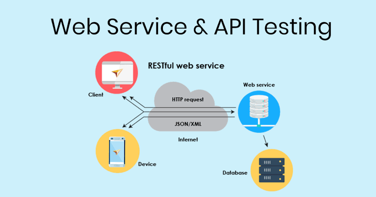

## The Plan

- API
- Webservice
  - Definition
  - Examples
  - Microservices Architecture
- Hyper Text Transfer Protocol
  - Definition
  - Examples


## API

### Definition

API = Application Programming Interface

:::{.callout-note}
**Interface** between two computers or two programs.

It is an application that provides services to other applications.

The application **implements** an API or **exposes** an API.
:::

---

A fairly broad term that covers:

 - Libraries / frameworks:
   - [Pandas](https://pandas.pydata.org/docs/reference/index.html){target="_blank"}
   - [Numpy](https://numpy.org/){target="_blank"}
 - Webservices
 - A way to access hardware resources
   - [Nvidia API](https://developer.nvidia.com/nvapi){target="_blank"}


### API in a Nutshell

- Exposes methods/functions to users
- Reusable
- Black box
- Contract between provider and user on inputs/outputs

::: {.notes}
Pour reprendre l'exemple du dessus, le module d'authentification peut être utilisé aussi bien par les utilisateurs pour la version site marchand, que par les admins pour la partie administration.
:::

---

:::{.callout-note}
An API provides a service to users without them needing to know how it works.
They only know what it expects as input and what it produces!
:::

## Webservices

A specific type of API.

:::{.white-box}
{width=80%}
:::

### Question

In your opinion, does X allow everyone to directly access their databases?

::: {.notes}
Bien sûr non !
:::

### Wait what?!

- But many sites use X's data!
- How do they do it?


:::::: {.hide-html-render}
### Any ideas?

<iframe src="https://giphy.com/embed/8acGIeFnqLA7S" width="600" height="600" frameBorder="0" class="no-print giphy-embed" allowFullScreen></iframe>
::::::


### Solution: Web Scraper

Involves writing an application that:

 - Connects to a site
 - Reads the page to extract information

**Problems:**

 - Creates artificial traffic (on the site's side)
 - Any change in the site breaks our application
 - Managing JavaScript 😱😱😱😱

::: {.notes}
Dire que derrière un site il y a du HTML.

Montrer un exemple ?

Prix SNCF à l'INSEE
:::

### Another Solution: Create an Entry Point for Machines

- Accessible from the web
- Made for machines
- **Controls what is made accessible**

:::{.callout}
Interface between the outside and our system
:::

### Démo

::: {.notes}
- [https://api.gouv.fr/documentation/api_data_gouv](https://api.gouv.fr/documentation/api_data_gouv)  
- [https://anapioficeandfire.com/](https://anapioficeandfire.com/)
- [Le trafic à Rennes en temps réel](https://data.rennesmetropole.fr/api/records/1.0/search/?dataset=etat-du-trafic-en-temps-reel)
:::


### Webservices

- Web application
- **Accessible via HTTP/HTTPS request**
- No graphical interface
- **Returns data understandable by machines (JSON, XML, etc.)**

::: {.notes}
Webservice : une API particulière que nous allons utiliser
:::


### Several Types

- REST: most common, the type you will handle, JSON
- SOAP: more complete but heavier than REST, XML
- RPC: Remote Procedure Call

::: {.notes}
REST est un style architectural qui définit un ensemble de contraintes et de principes
:::


### In Summary

:::{.callout-note}
A web service is an application module, accessible over the HTTP protocol via a URL that will respond to a request
:::

:arrow_right: Like a website, but for machines


### Microservices Architecture

E-commerce site:

- Authentication WS
- Account management WS
- Payment WS
- Search WS
- Data analysis WS
- Cart management WS


### Microservices Architecture

- Each module is an independent web service
- It is the client-side application that will contact them

:::{.callout-note}
Useful for large companies with many developers and parallel projects.
:::

::: {.notes}
Un dessin pourrait peut-être aider
:::

:::::: {.hide-html-render}
### How Does It Work?

<iframe src="https://giphy.com/embed/a5viI92PAF89q"  width="900" height="500" frameBorder="0" class="no-print giphy-embed" allowFullScreen></iframe>
::::::


### The Client-Server Concept

- **THE MODEL THAT GOVERNS THE WEB**
- Machines waiting for requests: **servers**
- Machines making requests: **clients**
- The client initiates contact, the server responds


### Real-Life Comparison

- You are walking down the street and want a Double shot espresso and Cream
- You enter a Starbucks and **order** your coffee
- The **server** processes your request and gives you your coffee
- You leave with your coffee

::: {.notes}
Vous vous moquez de comment à été fait votre café, tant que c'est bon
:::


## Hyper Text Transfer Protocol (HTTP)

### HTTP

Client-server communication protocol developed for the World Wide Web

Not the only one: FTP, SMTP, IRC...

There are non-client-server protocols: BitTorrent

::: {.notes}
Avez vous une idée de requête HTTP ?

- Internet est l'infrastructure
- Web est un service qui fonctionne dessus

https : http + SSL

Le navigateur cache le protocole
::: 


### Secure Sockets Layer (SSL)

Secure connection between a client and a server:

- The **client** sends a message to the **server**
- The **server** responds and sends its [certificate]{.underline}
- The **client** verifies the validity of the certificate
- The **client** generates a [session]{.underline} key encrypted with the **server's** public key
- Both parties communicate with the session key

::: {.notes}
Commencer par parler chiffrage :

- Chiffrage symétrique : Une seule clé est utilisée pour chiffrer et déchiffrer les données
- Chiffrage asymétrique : une clé publique pour chiffrer les données et une clé privée pour les déchiffrer

Certificat :

- Clé publique
- Informations sur le propriétaire
- Période de validité
- Autorité de certification
- Signature numérique : message haché puis chiffré avec clé privée
:::

### Video




### Les éléments d'une requête


- Location of the resource: URL (domain name + path)
- Method used (GET, POST, UPDATE, DELETE...)
- Request parameters
- Request body

::: {.notes}
Les paramètres sont derrière le ?

Le corps vous ne le voyez pas, mais il est possible de le voir.

Dans le navigateur, on ne fait que des GET
:::

### Elements of a Request

`GET https://pokeapi.co/api/v2/pokemon?limit=10&offset=200`

- method
- protocol
- ws address
- endpoint
- parameters

::: {.notes}
Pour aller plus loin : IP, DNS
:::

### HTTP Methods

- POST
- GET
- UPDATE
- DELETE

::: {.callout-important}
C'est le CRUD !
:::

::: {.notes}
Comme en SQL
:::


### Example

- GET http://web-services.domensai.ecole/attack
  - retrieve all attacks
- GET http://web-services.domensai.ecole/attack/2684
  - retrieve an attack by its id
- DELETE http://web-services.domensai.ecole/attack/2684
  - delete an attack

---

- POST http://web-services.domensai.ecole/attack
  - add an attack
- PUT http://web-services.domensai.ecole/attack/2684
  - modify an attack

```{.json filename="body"}
{
  "name": "tickle",
  "attack_type": "physical attack",
  "power": 2,
  "accuracy": 5,
  "description": "string"
}
```

:::{.notes}
- PATCH http://web-services.domensai.ecole/attack/2684
  - modifier seulement certains attributs d'une attaque
:::

### In Summary

- HTTP is the protocol of the web
- Method
- URL
- Parameters in URL or body


## Contacting/Creating a Webservice

### Contacting a Webservice

A tool: an HTTP client

- A web browser (quite limited)
- Insomnia/Postman/Bruno
- Vscode with plugins
- Python with the `requests` plugin


### Contacting a Webservice in Python

```{.python}
import requests
# Building the request
url = "https://data.rennesmetropole.fr/api/records/1.0/search/"
parameters = {"dataset": "etat-du-trafic-en-temps-reel", "rows": 2}
# Launching the request
res = requests.get(url=url, params=parameters)
# Displaying the result
print(res.json())
print("\nNumber of rows: ", res.json()["parameters"]["rows"])
```

---

```{.python}
import json
import requests
url = "https://anapioficeandfire.com/api/"
end_point = "characters"
parameters = {"gender": "Female", "isAlive": True, "culture": "Braavosi"}
response = requests.get(url=url + end_point, params=parameters)
# Check if the server responded
if response.status_code != 200:
    raise Exception(f"Cannot reach (HTTP {response.status_code}): {response.text}")
print(json.dumps(response.json()))
```

---

- Very easy
- `res.json()` returns a dictionary
- `get()` can become `post()`, `put()`, etc.


### Creating a Webservice in Python

- May seem complex 😵
- But there are tools to help us 😎
- No need to be a computer expert! 🐱‍💻


### 3 Frameworks

- [FlaskRESTful](https://fastapi.tiangolo.com/){target="_blank"}: mature, lightweight, flexible
- [Django](https://www.djangoproject.com/){target="_blank"}: mature, robust, complete
- [FastApi](https://fastapi.tiangolo.com/){target="_blank"}: young, lightweight, modern

::: {.notes}
FastApi pour le TP2
:::

### FastApi: The Basics

```{.python}
from fastapi import FastAPI
app = FastAPI()
@app.get("/")

async def root():
    return {"message": "Hello World"}

if __name__ == "__main__":
    uvicorn.run(app, host="0.0.0.0", port=8000)
```

### FastApi

- It is easy to code your endpoints
- The [documentation](https://fastapi.tiangolo.com/tutorial/first-steps/){target="_blank"} is extremely well done
- You focus on the essentials
