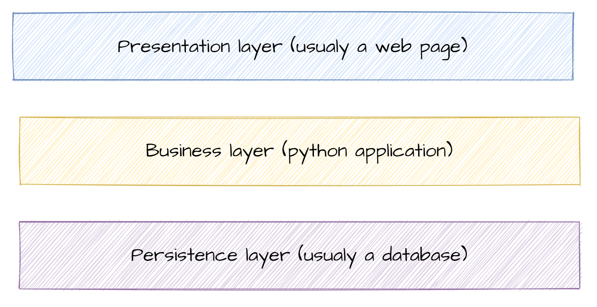

## Plan

1. L'analyse fonctionnelle
    - Définition
    - Diagrammes UML
2. L'architecture logicielle
    - Définition
    - Séparation des responsabilités

:::::: {.hide-html-render}

## Analyse fonctionnelle

<iframe src="https://giphy.com/embed/l0HlQngl0Eja36dlS" width="960" height="540" frameBorder="0" class="giphy-embed no-print" allowFullScreen></iframe>

::: {.notes}
80 % des projets sont un echec (total ou relatif).

Les questions qu'il faut se poser avant de commencer :

- Qu'est ce qu'on fait ? Qui le fait
- Besoins du client
- Fonctionnalités requises / optionnelles / bonus
- Bien gérer les priorités
- Répartition des rôles dans l'équipe

:::

::::::

### Phases d'un projet

- Analyse des besoins
- Planification
- Conception
- Développements
- Recette
- Déploiement
- Maintenance

::: {.notes}
Dans les projets classiques (Cycle en V), ces phases étaient très ségmentées
:::

---

::: {.notes}
- Important de discuter
- Reformulez
- Utilisez des mots simples
- Imaginez que vous expliquez le projet à vos grands parents
- parler doc, arrivée sur poste, initiatives
:::

### C'est quoi l'analyse fonctionnelle ?

- Première étape de tous les projets
- Détermine les fonctions, acteurs du produit pour répondre aux besoins du client
- Diagrammes pour échanger avec le client
- Priorise les travaux

::: {.notes}
- Permet de s'approprier le sujet
- Ce n'est pas du temps perdu car rajouter des fonctionnalités non prévues est extrêmement compliqué
- Cette phase sera la première partie du rapport intermédiaire

coût d'ajout d'une fonctionnalité / coût correction bug

Cost of Change Curve:

- Cahier des charges : 1 €
- Développement : 10 €
- Tests : 50 €
- Production : 100 €
:::

### Les questions à se poser

- Quels sont les types d'utilisateurs qui vont utiliser mon application (administrateur, gestionnaire, client...) ?
- Quelles sont les fonctionnalités ? Fonctionnalités communes entre les profils ?
- Comment fonctionnent les processus de l'application ?
- Quels sont les diagrammes à utiliser ?

::: {.notes}
- Pour les premières questions diagramme de cas d'utilisation
- Processus -> diagramme d'activité
- Pourquoi faire des diagrammes ? D'un coup d'oeil on a toutes les infos
  - Commentez vos diagrammes
:::

### Les diagrammes UML

- Cours de 1A
- UML 2.5, Pascal Roques, Eyrolles, Mémento (bibliothèque Ensai)

::: {.notes}
- Pas le temps de vous refaire un cours
- Il y a des ressources à la bibliothèque et sur internet
- Demandez à votre tuteur ce qu'il attend
:::

:::::: {.hide-html-render}
### Questions ?

<iframe src="https://giphy.com/embed/TgF6xfH8V0mZcUyneP" width="960" height="540" frameBorder="0" class="giphy-embed no-print" allowFullScreen></iframe>
::::::

## Architecture logicielle

::: {.notes}
Voila pour les grand principes.

On va maintenant rentrer dans le concret.
:::

### C'est quoi l'architecture logicielle ?

- Le pendant technique de l'analyse fonctionnelle
- Maintenant que l'on a le qui et quoi, on détermine le comment
- On dessine le code de notre application
- Vision macro de notre application (agencement des grandes pièces)

::: {.notes}
Pour le moment on ne fait pas encore de code.

On va seulement faire une ébauche de notre application avec les composants qui la compose (aussi bien logique que physique).

Par exemple dans votre cas vous allez sûrement avoir :

- Un code python qui tourne sur votre ordinateur
- Un webservice externe qui vous fournis des données
- Une base de données postgres.

C'est déjà 3 composants, mais rapidement on en beaucoup et il faut savoir comment les agencer
:::

:::::: {.hide-html-render}
### Pourquoi c'est important : parallèle avec l'architecture

::::::

### Pourquoi c'est important : parallèle avec l'architecture

- Pièces, l'installation électrique, l'eau, le gaz, contraintes législatives, s'adapter au terrain...
- Besoin de réfléchir comment il faut agencer tout ça dès le début
- Si on construit au fil de l'eau, on risque d'avoir une maison incohérente (au mieux)
- **Ce n'est pas du temps perdu !**

::: {.notes}
Certaines personnes disent même qu'on devrait passer plus de temps à analyser qu'à coder. 

Sujet à débat, mais cela montre bien que la phase d'analyse (comment je code les fonctions) est super importante !  

Les IAgen peuvent presque coder à notre place.
:::

### Un grand principe : separation of concerns

::: {.notes}
Version macro en 3 couches.

- Présentation : tout ce qui se charge de l'affichage
- Business : c'est le métier de votre application, sa plus-value
- Data : stockage des données

Chaque couche communique avec celles adjacentes.  
Une couche a juste à savoir comment elle doit demander une information et ce qu'on lui retourne.  
Pas évident mais très important !!!
:::

### Les principales couches d'une application

- **_Présentation :_** tout ce qui se charge de l'affichage (page web, console, fenêtre)
- **_Métier :_** c'est le métier de votre application, sa **plus-value**
- **_Persistance :_** gère la persistance des données. Base de données ou système de fichiers

::: {.notes}
Dans le monde pro :

- Présentation : JavaScript
- Métier : Java / Python
- Persistance : PostgreSQL ou MariaDB
:::

### Pour votre projet

- **_Présentation :_** terminal
- **_Métier :_** votre code Python
- **_Persistance :_** base de données

::: {.notes}
Exemple page web
:::

### Zoom sur la couche métier

::: {.notes}
À l'intérieur de la couche Métier, il y a plusieurs sous-couches.

Dans les TP :

- Couche présentation : View (on navigue entre des vues)
- DAO, business_object, service
- Contrôleur (client) : Il reçoit les demandes de l'utilisateur via l'interface utilisateur (par exemple, une requête HTTP dans le cas d'une application Web) et appelle les services appropriés pour exécuter les actions demandées.
:::

### Les couches de la couche métier 1/2

- **_DAO_ (_Data access object_) :**
  - C'est la partie de votre code qui communique avec la base de données (CM4/TP4)
  
- **_Service :_**
  - Code métier
  - Manipule des objets métiers pour créer de l'information ou de la valeur
  - Demande des objets à la couche DAO (TP4)
  - Appelle les webservices externes (TP3)

### Les couches de la couche métier 2/2

- **_Objets métiers :_**
  - Couche transversale
  - Représentent des concepts métiers que votre code va manipuler
  - Objets avec surtout des attributs et peu de méthodes

- **_Contrôleur :_**
  - Récupère les inputs des utilisateurs
  - Renvoie les données à afficher

::: {.notes}
On découpe les objets :

- Attributs -> Objets métiers (~DTO)
- Méthodes -> Services
:::

### Pourquoi séparer en couches ?

- Travail en groupe 🦸‍♀️🧙‍♂️👨‍💼👩‍🔬
- Lisibilité du code 📖
- Débogages 🐞

> **Limiter les risques d'erreurs quand on modifie le code (éviter l'assiette de spaghetti) 🍝**

::: {.notes}
Il faut savoir qu'un code doit être lisible par les autres.  
Et les autres, ça peut être soi-même dans 2 mois. Blague sur la relecture de code.  
Si on a un code bien séparé, différentes équipes peuvent travailler en parallèle.  
Et séparer en couches permet de trouver rapidement la source du problème.
:::

### Informations à retenir

- Passer du temps à réfléchir aux différents modules d'une application n'est pas une perte de temps 🕵️‍♀️
- Diviser en couches permet de travailler en parallèle 🧪🧫📚
- Mais il faut encore réfléchir à comment bien coder 🤖

::: {.notes}
Possible en projet de se répartir les couches.
:::
