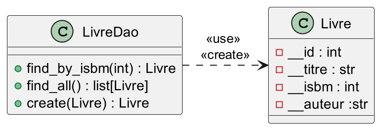

## Le plan {.smaller}

- Data Access Object
  - Pourquoi persister des données ?
  - C'est quoi une DAO
  - Exemple de DAO
- Sécurité Informatique
  - Définition
  - Failles de sécurité
  - Injection SQL
- Gestion des mots de passe
  - Authentification avec cypher
  - Hashage de mots de passe
  - Exemple

::: {.notes}
Nous allons commencer par parler Stockage des données
:::

## Data access object (DAO)

:::::: {.hide-html-render}
<iframe src="https://giphy.com/embed/dIBLtolI6axTGIGopo" width="960" height="540" frameBorder="0" class="giphy-embed no-print" allowFullScreen></iframe>
::::::

::: {.notes}
Notre objectif va être de stocker des données, mais avant :
:::

### Un ordinateur

Quels sont ses composants (en gros) ?

:::{.fragment}
- Un processeur (CPU) : fait UNIQUEMENT du calcul
- La mémoire RAM : mémoire volatile rapide
- Disque dur (HDD, SSD) : mémoire longue durée
- Carte graphique : unité de calcul spécialisée
:::

::: {.notes}
Bien insister sur CPU, RAM, disque !

Rendent 3 services différents :

- CPU : processeur
- DD : disque
- RAM : barrettes
:::

### Comment résoudre ce problème ?

:::::: {.hide-html-render}

::::::

::: {.fragment}
Quel problème ??
:::

::: {.notes}
Réponse : Conserver les données une fois le programme Python terminé
:::

### Une question à se poser

```{.python code-line-numbers="false"}
p = Personnage(prenom="Leia", nom="Organa", age = 35)
```

C'est quoi une variable Python ?

:::{.fragment}
- Une référence (le nom de la variable)
- **Un objet associé (sa valeur)**
:::


::: {.notes}
On zappe la notion d'adressage mémoire.  
Pas besoin de stocker la référence, car elle est dans le code source  
:::

### Une question qui en découle

```{.python filename="personnage.py"}
class Personnage:
    def __init__(self, prenom, nom, age):
        self.prenom = prenom
        self.nom = nom
        self.age = age
        self.vaisseaux = []

    def anniversaire(self):
        self.age += 1
```

C'est quoi un objet Python ?

:::{.fragment}
- Des attributs (qui peuvent être eux-mêmes des objets)
- Des méthodes
:::


::: {.notes}
Pareil, les méthodes c'est du code, nous on veut juste les attributs
:::

### Pour résumer

- Nous voulons sauvegarder des couples clef-valeur  
- Avec des valeurs qui peuvent être elles-mêmes constituées de couples clef-valeur

::: {.callout}
**Nous voulons sauvegarder un arbre 🌳**
:::

::: {.notes}
Besoin d'un dessin avec Leia et Vaisseaux

Parallèle avec les dict Python / JSON

Arbre car les attributs d'objets sont parfois eux-mêmes des objets
:::

### Comment faire cela ?

- Écrire nos données sur le disque dur dans un fichier 
  - csv, parquet, json, xml
- Utiliser une base de données
  - SQL tables + relations, NoSQL

::: {.notes}
Question : Comment fait une BDD ?

- Elle gère dans des fichiers  
- On peut faire le parallèle avec les couches  
- La BDD rend un service, j'ignore comment elle fait  
- Je sais ce qu'elle attend en entrée et ce qu'elle me donne en sortie !  
:::

### Lien persistance / application

- Python : Variables volatiles en RAM
- Système de persistance : Données stockées sur disque
- Data Access Objects (DAO) en guise de lien

::: {.notes}
Petite pause récap pour essayer de récupérer tout le monde avant la DAO.

Dans la vraie vie, on ne repart pas de 0 quand on relance une appli.

Si vous créez un Personnage, la fois suivante il sera toujours là
:::

### C'est quoi une DAO ?

:::::: {.hide-html-render}

::::::

::: {.notes}
On vient de dire que l'on va stocker dans une BDD.

Comment y accéder ?
:::

### C'est quoi une DAO ?

- Classe technique
- Une classe DAO par objet métier
- Expose des méthodes pour communiquer avec la couche de persistance

::: {.notes}
C'est une API

Rend un service à des clients

Comment elle fait ? -> osef

Comme vous au restaurant. Vous voulez manger, comment c'est fait vous importe peu tant que le service est rendu (avec un niveau d'exigence)

Des ORM tels SQLAlchemy existent pour faire le lien Objet Python - Table BDD -> pas le sujet ici
:::

### Quelles méthodes exposer ?

:::{.fragment}
- **C**reate
- **R**ead
- **U**pdate
- **D**elete
:::

::: {.notes}
Faire participer  

Essayer de montrer que ces 4 là suffisent.

Après on peut avoir des raffinements en faisant des choses en masse, ou filtrer, etc.


Quid de la copie ?

Une copie c'est une lecture + création donc on sait faire


Exemple dessin : classe Personne - table personne - dao personneDAO
:::

### L'intérêt d'une classe à part

Séparation des responsabilités

- Classe "jetable" 🚮
- Modifiable sans risque 🔨
- Parallélisation du travail 🦸‍♀️🧙‍♂️👨‍💼👩‍🔬

::: {.notes}
On remet une couche, ça fait pas de mal  
Dans la vraie vie, si changement de système, plus facile de migrer  

En projet, la couche DAO peut être très facile à faire
:::

### Petit recap


::: {.notes}
Petit exemple pour illustrer.

Exemple : lister toutes les personnes fans de Pokemon
:::

## Comment se connecter à une DB en python ?

Utilisation d'une bibliothèque dédiée

- **PostgreSQL** : [psycopg2](https://www.psycopg.org/docs/){target="_blank"}
- MySQL : mysql-connector-python
- Oracle : cx_Oracle
- MongoDB : pymongo

::: {.notes}
Vous lirez en entier la doc : psycopg2. 

Il y aura des questions à l'exam !
:::

### psycopg2

- `pip install psycopg2-binary`

- `connection` : permet d'établir la connexion avec la base  
  Pas super intéressant à faire, le code est donné


### psycopg2 - connection

```{.python filename="db_connection.py"}
import os
import dotenv
import psycopg2

from psycopg2.extras import RealDictCursor
from utils.singleton import Singleton

class DBConnection(metaclass=Singleton):
    """
    Classe de connexion à la base de données
    Elle permet de n'ouvrir qu'une seule et unique connexion
    """

    def __init__(self):
        """Ouverture de la connexion"""
        dotenv.load_dotenv()

        self.__connection = psycopg2.connect(
            host=os.environ["POSTGRES_HOST"],
            port=os.environ["POSTGRES_PORT"],
            database=os.environ["POSTGRES_DATABASE"],
            user=os.environ["POSTGRES_USER"],
            password=os.environ["POSTGRES_PASSWORD"],
            options=f"-c search_path={os.environ['POSTGRES_SCHEMA']}",
            cursor_factory=RealDictCursor,
        )

    @property
    def connection(self):
        return self.__connection
```

::: {.notes}
Singleton
::: 

### psycopg2 - cursor

- `cursor` : encapsule la requête
  ```{.python}
  from dao.db_connection import DBConnection
  
  with DBConnection().connection as connection:
      with connection.cursor() as cursor:
  ```
- `cursor.execute("<une requête SQL>")` : permet de faire une requête
- `cursor.fetchone()/fetchall()/fetchmany()` : Récupération des résultats


### Forme de base

```{.python}
def dao_function(self, arg1, arg2, ...):
    # Récupération de la connexion à la base
    with DBConnection().connection as connection:
    # Création d'un curseur pour faire une requête
        with connection.cursor() as cursor:
            # On envoie au serveur la requête SQL
            cursor.execute(
                "<une_requete_sql_à_trous>",
                remplisage_des_trous)

            # On récupère le résultat de la requête
            res = cursor.fetchone()  # ou fetchall()/fetchmany()

    # Si la requête renvoie quelque chose
    if res:
      something = "<res mis en forme>"
        
    return something   
```

::: {.notes}
Pourquoi on ne retourne pas directement res ?

res : list[dict]

On préfère retourner un Objet ou une liste[Objet]
:::

### Un petit exemple : LivreDao



::: {.notes}
ISBN : International Standard Book Number
:::


### Créer un livre

```{.python}
def create(self, livre) -> Livre:
    """Pour créer un livre en base"""
    with DBConnection().connection as conn:
        with conn.cursor() as cursor:
            cursor.execute(
                "INSERT INTO livre (isbm, titre, auteur)         "
                "     VALUES (%(isbm)s, %(titre)s, %(auteur)s)   "
                "  RETURNING id_livre;                           ",
                {"isbm": livre.isbm, 
                 "titre": livre.titre, 
                 "auteur": livre.auteur},
            )
            livre.id = cursor.fetchone()["id_livre"]
    return livre
```

::: {.notes}
Possible aussi de retourner une booléen :

- true si création réussie
- false sinon
:::

### Lister les livres

```{.python}
def find_all(self) -> list[Livre]:
    """Pour récupérer tous les livres en base"""
    with DBConnection().connection as conn:
        with conn.cursor() as cursor:
            cursor.execute(
                "SELECT id_livre,                  "
                "       isbm,                      "
                "       titre,                     "
                "       auteur                     "
                "  FROM livre ;                    "
            )
            livre_bdd = cursor.fetchall()
            
    liste_livres = []

    if livre_bdd:
        for livre in livre_bdd:
            liste_livres.append(
                Livre(
                    id=livre["id_livre"],
                    isbm=livre["isbm"],
                    titre=livre["titre"],
                    auteur=livre["auteur"],
                )
            )
            
    return liste_livres
```

:::{.notes}
- livre_bdd = [{id_livre=1, isbm=123, "Le Schtroumpf hackeur", "Peyo"}, {...}, ...]
- livre = {id_livre=1, isbm=123, "Le Schtroumpf hackeur", "Peyo"}
- liste_livres = [Livre(1, 123, "Le Schtroumpf hackeur", "Peyo"), Livre(...), ...]
:::

### Trouver un livre

```{.python}
def find_by_isbm(self, isbm) -> Livre:
    """Pour récupérer un livre depuis son isbm"""
    with DBConnection().connection as conn:
        with conn.cursor() as cursor:
            cursor.execute(
                "SELECT *                          "
                "  FROM livre                      "
                " WHERE isbm = %(isbm)s            ",
                {"isbm": isbm}
            livre_bdd = cursor.fetchone()
            
    livre = None
    if livre_bdd:
        livre = Livre(
            id=livre_bdd["id_livre"],
            isbm=livre_bdd["isbm"],
            titre=livre_bdd["titre"],
            auteur=livre_bdd["auteur"],
        )
    return livre
```

:::{.notes}
livre_bdd : dict
livre : Livre

Principe à retenir si vous voulez comprendre : nous allons toujours dans les DAO transformer les dict en objets
:::

### Conclusion

- Python travaille en RAM (volatile)
- Obligation d'avoir un mécanisme de persistance des données
- DAO : centralise les méthodes pour lire/écrire nos données
- La couche métier appelle la DAO sans se préoccuper du système de persistance
- Permet un travail d'équipe efficace 🦸‍♀️🧙‍♂️👨‍💼👩‍🔬


## Sécurité informatique

### Principes CAID

::: {.hide-html-render}

:::

### 4 piliers de la sécurité info

- **C**onfidentialité
- **A**uthentification
- **I**ntégrité
- **D**isponibilité

::: {.notes}
On utilise aussi parfois DICP ou DICPA

Disponibilité, Intégrité, Confidentialité, Preuve
:::

### Deux bonus

- Traçabilité
- Non-répudiation

### Confidentialité

::: {.callout}
Seules les personnes autorisées doivent avoir accès aux informations qui leur sont destinées (notions de droits ou permissions). 

Tout accès indésirable doit être empêché.
:::

**Mécanismes associés :** 

- gestion des droits (annuaires, rôles ...)
- cryptographie

::: {.notes}
On parle plutôt de chiffrement
:::

### Authentification

::: {.callout}
Les utilisateurs doivent prouver leur identité en répondant à un "challenge".
:::

**Mécanismes associés :** 

- authentification faible (identifiant, mot de passe)
- authentification forte (données biométriques, multi-facteurs)

### Intégrité

::: {.callout}
Les données doivent être celles que l'on attend, et ne doivent pas être altérées de façons fortuites, illicites ou malveillantes.
:::

**Mécanismes associés :** 

- signature électronique
- checksum

:::{.notes}
**Signature électronique :** garantir l'intégrité d'un document, c'est-à-dire s'assurer que le document n'a pas été altéré entre sa signature et sa consultation; authentifier son auteur, c'est-à-dire s'assurer de l'identité de la personne signataire.

**Checksum :** bit de parité.
:::


### Disponibilité

::: {.callout}
L'accès aux ressources du système d'information doit être permanent et sans faille durant les plages d'utilisation prévues.
:::

**Mécanismes associés :** 

- redondance des serveurs
- virtualisation
- conteneurisation

:::{.notes}
Backup

Parler de la mise en production avant.
:::

### Traçabilité

::: {.callout}
Garantit que les accès et tentatives d'accès aux éléments considérés sont tracés et que ces traces sont conservées et exploitables.
:::

**Mécanisme associé :** 

- journalisation

:::{.notes}
Logs (mieux que les prints)

Projet 2024-2025
:::

### La non-répudiation

::: {.callout}
Aucun utilisateur ne doit pouvoir contester les opérations qu'il a réalisées dans le cadre de ses actions autorisées et aucun tiers ne doit pouvoir s'attribuer les actions d'un autre utilisateur.
:::

**Mécanismes associés :** 

- traçabilité
- authentification
- intégrité

:::{.notes}
C'est pas moi

Mais c'est votre nom !

Ne laissez pas vos sessions ouvertes aux pauses (CTRL + ALT + F12)
:::


## Les failles informatiques

### Trop de failles !!!

- Failles physiques "bas niveau"
- Failles physiques "haut niveau"
- **Injection SQL**
- Injection de données
- **Faille XSS**
- Exécution de code
- ...

:::{.notes}
- Failles physiques "bas niveau" : coupure électrique, inondation salle serveur
- Failles physiques "haut niveau" : accès physique à une machine
:::


### De quoi faut-il se méfier ?

::: {.hide-html-render}

:::

:::{.fragment}
**De vos utilisateurs**
:::

## Exemple de failles, les injections SQL


: Source : <https://xkcd.com/>{target="_blank"}


### Injection SQL

Consiste à saisir du SQL pour exécuter une autre requête que celle prévue.

Problèmes :

- Confidentialité
- Authentification
- Intégrité
- Disponibilité

### Exemple : s'authentifier sans mot de passe

Requête d'authentification

```{.sql}
SELECT * 
  FROM user 
 WHERE name = 'input_name' 
   AND mdp = 'input_mdp';
```

::::::{.fragment}
::: {.callout-note title="Vous saisissez"}
- Gennysson
- awsome_password
:::
::::::

:::{.fragment}
```{.sql}
SELECT * 
  FROM user 
 WHERE name = 'Gennysson' 
   AND mdp = 'awsome_password';
```
:::

:::{.notes}
Si dans votre cursor.execute vous avez ce code
:::

### Exemple : s'authentifier sans mot de passe

```{.sql}
SELECT * 
  FROM user 
 WHERE name = 'input_name' 
   AND mdp = 'input_mdp';
```

::::::{.fragment}
::: {.callout-warning title="Vous saisissez"}
- Gennysson
- `' OR 1=1; --`
:::
::::::

:::{.fragment}
```{.sql}
SELECT * 
  FROM user 
 WHERE name = 'Gennysson' 
   AND mdp = '' OR 1=1; --';
```
:::

### Exemple : supprimer une table

```{.sql}
SELECT * 
  FROM user 
 WHERE name = 'input_name' 
   AND mdp = 'input_mdp';
```

::::::{.fragment}
::: {.callout-warning title="Vous saisissez"}
- Gennysson
- `'; DROP TABLE user CASCADE; --`
:::
::::::

:::{.fragment}
```{.sql}
SELECT * 
  FROM user 
 WHERE name='Gennysson' 
   AND mdp=''; DROP TABLE user CASCADE; --;
```
:::

---

:::{.hide-html-render}
{width=50%}
:::

### Comment se protéger ?

- Échapper les caractères spéciaux
- Utiliser une requête préparée

**La bibliothèque que vous utiliserez ne fait que de l'échappement de caractères spéciaux 😨**

:::{.notes}
La seconde solution est mieux que la première mais psycopg2 ne semble pas la proposer simplement.  
Donc il faut la connaître, mais savoir que c'est la première solution qui va être faite.

Échapper les caractères spéciaux : par exemple, « ' » sera remplacé par « \' »  
L'apostrophe ne sera donc pas interprétée comme une fin de chaîne par le SGBD

Instruction "prepare" :  
1. Envoie la requête à trous à la BDD  
2. Envoie pour remplir les trous
:::

### Cross Site Scripting

Consiste à injecter du code provoquant des actions sur le navigateur. Cela peut permettre :

- Des redirections de page (phishing)
- Du vol d'information
- Des actions sur le site
- Rendre le site difficile à utiliser

### Comment se protéger ?

- Ne jamais insérer des données brutes
- Échapper les caractères spéciaux
- Vérifier vos données


::: {.callout-tip}
Les bibliothèques web le font souvent pour vous !
:::


### To sum up : injection

- Ne jamais faire confiance aux utilisateurs, vérifier / nettoyer leurs inputs
- Ne jamais faire confiance aux utilisateurs, vérifier / nettoyer leurs inputs
- Ne jamais faire confiance aux utilisateurs, vérifier / nettoyer leurs inputs


## Gestion des mots de passe

Pour tester la solidité d'un mot de passe :

- <https://ssi.economie.gouv.fr/motdepasse>{target="_blank"}

### Votre application doit-elle stocker des mots de passe en clair?

::::::{.fragment}
::: {.hide-html-render}
{width=100%}
:::
::::::

### Votre application doit-elle connaître le mot de passe d'un utilisateur pour l'authentifier ?

::::::{.fragment}
::: {.hide-html-render}
{width=50%}
:::
::::::

### Comment on fait ?

::: {.hide-html-render}
{width=100%}
:::

### Hasher le mot de passe

- Hashage du mot de passe
- Stockage du hash en base
- Quand besoin de comparer on hashe le mdp saisi
- Et on compare les hashs

**Authentification sans persister les mots de passe !!!!**

:::{.notes}
C'est tellement simple et sécurisé !  
Mais pas tous les sites le font ...  
Un site qui vous renvoie votre mdp le garde en mémoire (ou du moins le moyen de le déchiffrer)  

Dans la vraie vie, on rajoute un "sel" au mdp avant de le hacher.  
C'est une valeur aléatoire calculée pour chaque utilisateur que l'on va rajouter au mdp avant de le hacher  
Cela rend une attaque en force brute plus coûteuse.
:::

---

::: {.hide-html-render}

:::

### Ajouter du sel pour plus de sécurité

::: {.hide-html-render}

:::

### Une base sans sel ajouté

- Votre base mail/mdp fuite mais les mdp sont hachés
- Les attaquants doivent _bruteforce_ les mdp
- Ils commencent par les mdp les plus courants, et les hachent avec les algo de hash courants
- Puis ils comparent avec la base
- Forte chance d'avoir plusieurs correspondances

:::{.notes}
bruteforce : tester toutes les combinaisons possibles
:::


### Le sel c'est bon pour la sécurité

Au lieu de hacher et stocker le mdp vous stockez et hachez le mdp 
ET un élément lié à l'utilisateur de manière déterministe (le sel).

Maintenant même si 2 personnes ont le même mdp, elles auront des hash
différents.

### Le sel c'est bon pour la sécurité

- Votre base mail/mdp fuite mais les mdp sont hachés et salés
- Les attaquants doivent *bruteforce* les mdp
- Ils commencent par les mdp les plus courants, et les hachent avec les algo de hash courants
- Puis ils comparent avec la base.
- Il y a pas de match car vos mdp sont salés
- Et trouver un mdp ne permet de trouver les autres

---


### Exemple de hashage de mdp

```{.python}
import hashlib
 
def hash_password(password, idep):
    salt = idep
    return hashlib.sha256(salt.encode() + password.encode()).hexdigest()
    
print(hash_password("awsome_password", "Gennysson"))
```

### To sum up the security part

- Toujours vérifier les inputs
- Ne jamais faire confiance aux utilisateurs
- Plusieurs niveaux de sécurité
- Pas besoin de stocker les mots de passe en clair
