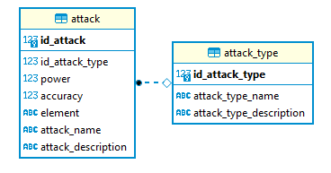

- Examen sur papier
- Durée : 2h
- Une feuille A4 [manuscrite]{.underline} recto/verso autorisée
- Sans calculatrice

::: {.callout-important title="À lire avant de commencer"}
Le sujet est composé de plusieurs pages, numérotées de 1 à la dernière page.

- Les exercices peuvent être traités dans l'ordre de votre choix.
- Dans chaque exercice, les questions ne sont pas forcément de difficulté croissante.
- Sauf mention contraire, les différentes questions attendent des [réponses courtes]{.underline}.
- Respectez scrupuleusement les consignes. Cependant, si une question ne vous semble pas claire, notez sur votre copie la manière dont vous l'avez comprise et traitée.
- Quand du code est demandé, veuillez respecter les règles de bases du langage (mots clefs et indentation). Des erreurs seront tolérées, car vous êtes sur papier. En cas d'oubli d'un nom de méthode Python, utilisez du pseudo-code.
- Excepté si c'est demandé, il n'est pas nécessaire d'écrire la documentation du code (même si la doc c'est bien !)
:::

**Bonne chance !**



# Questions de cours (7 points)

a. **Citez les différents niveaux de logs ?**
  - DEBUG
  - INFO
  - WARNING
  - ERROR
  - CRITICAL
b. **Quelle est la différence entre un formateur et un linter ?**

Un linter signale le code qui n'est pas conforme aux bonnes pratiques, tandis qu'un formateur modifie le code pour qu'il respecte un style prédéfini.

c. **Quels sont les rôles des différentes couches de la couche métier ?**
  - DAO : communique avec la base de données.
  - Business Object : représente des concepts métiers.
  - Service : manipule des objets métiers pour créer de l’information ou de la valeur.
  - Controller ou View : fait le lien avec l'IHM.
d. **Qu’est-ce qu’une classe abstraite ?**

Une classe abstraite est une classe qui ne peut pas être instanciée. Elle sert de modèle pour d'autres classes qui héritent d'elle, permettant de définir une interface commune et de partager du code entre les classes filles.

e. **Qu'est-ce que le bridge pattern ?**

Le bridge pattern consiste à découper une grosse classe en un groupe de petites classes ayant leur propre hiérarchie, qu'il faut ensuite assembler.

f. **Quel est l'intérêt de faire des tests unitaires ?**

Les tests unitaires permettent de :

- Vérifier que votre méthode fonctionne.
- Détecter des erreurs.
- Éviter les régressions.

g. **À quoi sert un mock ?**

Un mock est un objet simulé qui sert à :

- Remplacer un composant réel lors des tests.
- Tester une unité de code en isolant ses dépendances externes.
- Simuler des scénarios complexes, comme les erreurs de réseau.

h. **Parmi les principes CAID, détaillez celui d'Authentification et les mécanismes associés.**

Les utilisateurs doivent prouver leur identité en répondant à un “challenge”.

Mécanismes associés :

- Authentification faible : identifiant, mot de passe.
- Authentification forte : données biométriques, multi-facteurs.

# Webservices (3 points)

a. **Qu'est-ce qu'une API ?**

Une API (Application Programming Interface) est une interface entre deux ordinateurs ou deux programmes. C’est une application qui offre des services à d’autres applications.

b. **Nommez les différents éléments de la requête suivante :**

`GET https://pokeapi.fr:5000/pokemon?limit=10`

- GET : méthode
- https : protocole
- pokeapi.fr : nom de domaine
- 5000 : port
- /pokemon : endpoint
- ?limit=10 : paramètre de la requête

c. **Parmi la liste suivante, quel package `Python` sert à interroger un webservice : requests, psycopg2, fastAPI, Insomnia, Django, inquirerPy ?**
  - requests



# Code (7 points)

a. **Écrivez le code d'une fonction `Python est_bissextile(annee)` qui :**
  - prend en paramètre un entier
  - retourne un booléen

Une année est bissextile si :

- Elle est divisible par 4
- Mais pas divisible par 100, sauf si elle est aussi divisible par 400

```{.python}
def est_bissextile(annee) -> bool:
    return (annee % 4 == 0 and annee % 100 != 0) or (annee % 400 == 0)
```

b. **Modifier le code ci-dessous pour appliquer le principe d'héritage.**

Nous remplaçons la classe `Pokemon` par :

```{.python}
from abc import ABC, abstractmethod

class AbstractPokemon(ABC):
    def __init__(self, name, level, attack, defense):
        self.name: str = name
        self.level: int = level
        self.attack: int = attack
        self.defense: int = defense

    def level_up(self, bonus:int=0) -> None:
        self.level += 1 + bonus

    @abstractmethod
    def get_attack_coef(self) -> float:
        pass

class AttackerPokemon(AbstractPokemon):
    def __init__(self, name, level, attack, defense):
        super().__init__(name, level, attack, defense)

    def get_attack_coef(self) -> float:
        return 1 + (self.attack) / 200

class DefenderPokemon(AbstractPokemon):
    def __init__(self, name, level, attack, defense):
        super().__init__(name, level, attack, defense)

    def get_attack_coef(self) -> float:
        return 1 + (self.defense) / 200
```

**Explications :**

- La classe `Pokemon` devient abstraite et hérite de `ABC`.
- Le constructeur change peu, si ce n'est que l'on peut retirer l'attribut `type_pk` puisque l'on connaîtra le type selon que l'objet sera un `AttackerPokemon` ou un `DefenderPokemon`.
- La méthode `level_up()` est commune et reste donc dans `Pokemon`.
- La méthode `get_attack_coef()` est abstraite et spécifiée dans chaque classe fille.

c. **Écrivez, en utilisant `pytest`, les tests unitaires de la méthode `level_up` ci-dessus.**

2 cas à tester :

- le paramètre `bonus` n'est pas renseigné
- le paramètre `bonus` est renseigné

> **Remarque :** ce n'était pas très judicieux de vous demander à ce moment là de tester cette méthode. Elle appartient maintenant à la classe `Pokemon`, or on ne peut pas créer d'objet `Pokemon` car la classe est abstraite. Pour répondre à la question nous allons tester cette méthode en instanciant un `AttackerPokemon`.

```{.python}
import pytest
from attacker_pokemon import AttackerPokemon

def test_level_up_ok():
    // GIVEN
    pikachu = AttackerPokemon(name="Pikachu", level=5, attack=50, defense=10)

    // WHEN
    pikachu.level_up()

    // THEN
    assert pikachu.level == 6

def test_level_up_bonus():
    // GIVEN
    pikachu = AttackerPokemon(name="Pikachu", level=5, attack=50, defense=10)
    
    // WHEN
    pikachu.level_up(bonus=1)
    
    // THEN
    assert pikachu.level == 7
```

d. **Écrivez la documentation de la méthode `level_up()` ci-dessus.**

```{.python}
    def level_up(self, bonus: int = 0) -> None:
        """
        Augmente le niveau du Pokemon de 1 par defaut, avec la possibilite
        d'ajouter un bonus optionnel.

        Parameters
        ----------
        bonus : int, optional
            Bonus supplementaire ajoute au niveau. Valeur par defaut : 0.

        Returns
        -------
        None
        """
        self.level += 1 + bonus
```



e. **En vous aidant du modèle de données ci-dessous, écrivez une requête SQL qui permet d'afficher le nom et la puissance de toutes les attaques de type « Special ».**

{width=60%}

```{.sql}
SELECT a.attack_name, 
       a.power
  FROM attack a
 INNER JOIN attack_type at USING(id_attack_type)
 WHERE at.attack_type_name = 'Special';
```

f. **Relevez les erreurs et les mauvaises pratiques du code ci-dessous ? Quelles conséquences cela pourrait-il avoir ?**

```{.python}
from dao.db_connection import DBConnection
from business_object.joueuse import Joueuse
    
class JoueuseDao(metaclass=Singleton):
    def se_connecter(self, pseudo, mdp) -> Joueuse:
        with DBConnection().connection as connection:
            with connection.cursor() as cursor:
                requete = " SELECT *                           "
                requete += "  FROM joueuse                     "
                requete += " WHERE pseudo = '" + pseudo + "'   "
                requete += "   AND mdp = '" + mdp + "';        "
                cursor.execute(requete)
                res = cursor.fetchall()
        return res
```

- Possibilité d'injection SQL
  - *Solution :* Utiliser des requêtes paramétrées avec des placeholders comme :
  - `cursor.execute("SELECT * FROM joueuse WHERE pseudo = %s AND mdp = %s", (pseudo, mdp))`
- Utilisation de `fetchall()` alors que l'on attend un seul résultat
  - *Solution :* Utiliser `fetchone()` à la place de `fetchall()`.
- Retour direct de `res` alors qu'on devrait générer un objet de type `Joueuse`
  - *Solution :* Mapper les résultats SQL à un objet `Joueuse`, par exemple :
  - `j = Joueuse(nom=res["nom"], prenom=res["prenom"], pseudo=res["pseudo"] ...`
- Pas de doc



# Git et Versionnage (3 points)

Vous travaillez avec deux collègues Alice et Bob qui découvrent git. Actuellement le projet de data science sur lequel vous travaillez tous est hébergé sur GitHub.

a. **Alice vous appelle car elle a besoin d'aide. Elle a passé son après-midi à travailler et veut pousser son code vers le dépôt distant mais elle ne sait pas comment faire. Comment doit-elle procéder ?**

```{.bash}
>>> git add <fichiers_crees_ou_modifies>  # ou directement : git add .
>>> git commit -m "mon super travail"
>>> git pull # Optionnel : pour verifier que rien n'a ete pousse entre temps
>>> git push
```

b. **Bob vous appelle car il n'arrive pas à pousser son code. Il reçoit en permanence cette erreur :**

```{.bash}
>>> git push
! [rejected] master -> dev (fetch first)
error: failed to push some refs to 'git@github.com:inseefrlab/dataproject.git'
hint: Updates were rejected because the remote contains work that you do
hint: not have locally. This is usually caused by another repository
hint: pushing to the same ref. You may want to first integrate the 
hint: remote changes (e.g., 'git pull ...') before pushing again.
```

**Aidez Bob pour qu'il puisse partager son code.**

Le message est assez explicite, Bob doit commencer par `git pull` pour mettre son dépôt local à jour.

c. **Maintenant Bob reçoit ce message. Expliquez à Bob ce qu'il doit faire pour débloquer la situation.**

```{.bash}
>>> git pull
remote: Enumerating objects: 12, done.
remote: Counting objects: 100% (11/11), done.
remote: Total 8 (delta 1), reused 0 (delta 0), pack-reused 0
Unpacking objects: 100% (8/8), 921 bytes | 25.00 KiB/s, done.
From github.com:inseefrlab/dataproject.git
d0790b4..3b27915  main       -> origin/main
Auto-merging main.py
CONFLICT (content): Merge conflict in main.py
Automatic merge failed; fix conflicts and then commit the result.
```

Il y a un conflit dans le fichier `main.py` car Git n'arrive pas à définir la bonne version entre celle du dépôt local de Bob et celle venant du dépôt distant. Bob doit ouvrir ce fichier, le modifier pour garder la version de son choix, et enfin refaire add, commit, push pour que les 2 dépôts soient synchronisés.

d. **À quoi sert le fichier `.gitignore` ?**

Le fichier `.gitignore` spécifie les fichiers et répertoires que Git doit ignorer et donc ne pas versionner.

e. **Vous arrivez un matin et tous les ordinateurs de votre société ont été volés. Est-ce grave pour votre projet ? Dans le pire des cas, combien de temps de travail avez-vous perdu ?**

Si vous versionnez régulièrement votre code, l'impact sur votre projet sera assez mineur.

Au pire, seules les modifications non encore poussées vers le dépôt distant sont perdues, ce qui correspond à quelques heures de travail.
