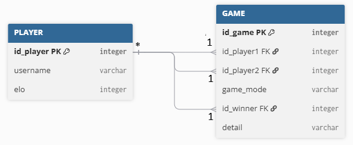

## Instructions {.unnumbered}

- Written exam
- Duration: 2 hours
- One A4 sheet of **handwritten** notes (front and back) allowed
- No calculator

::: {.callout-important title="Read Before Starting"}
- You can answer the exercises in any order.
- Within each exercise, the questions are not necessarily ordered by increasing difficulty.
- Unless otherwise stated, the questions expect [short answers]{.underline}.
- Strictly follow the instructions. If a question seems unclear, state your assumptions on your answer sheet.
- When code is required, follow the basic language conventions (keywords, indentation, etc.). Syntax errors due to handwriting will be tolerated. If you do not remember the exact name of a Python method, you may use pseudocode.
- Unless explicitly requested, code documentation is not required.
:::

Good Luck!



## Short course questions (3 points)

a. Give six examples of files or folders commonly found in an IT project.
b. List the main actors involved in an IT project.
c. What is a design pattern?
d. Which HTTP methods correspond to the CRUD operations?
e. Write an HTTP request needed to create a new Pokemon (name: Ponyta, type: Fire, level: 12) in `https://pokedex-api` (choose an appropriate endpoint).


## Multiple Choice Questions (8 points)

> Each question can have one or more correct answers (at least one answer is correct).
> Correct answer: 1 point. Partially correct answer: ratio. If there is a wrong answer: 0.

### Development tools: which statements are correct?

a. `pytest` is used to run unit tests.
b. `psycopg2` is used to communicate with PostgreSQL.
c. `requests` is used to communicate with PostgreSQL.
d. `FastAPI` is mainly used to format Python source code.
e. The `abc` module can be used to define abstract classes.
f. Swagger can be used to explore and test an API.


### Why can logging be preferable to using print() statements when debugging an application?

a. Logs can indicate the severity of a message.
b. Logs can be configured to be written to a file.
c. Logs can provide information about when an event occurred.
d. `print()` statements cannot display any information about an error.
e. Logging is only useful when an application crashes.


### Which statements describe good unit testing practices?

a. A unit test should verify a specific behaviour.
b. Tests should be reproducible.
c. A test should ideally be independent of unrelated external systems.
d. A unit test must always access the real production database.
e. Tests can help detect regressions after modifying the code.
f. A unit test depends on a specific execution order.


### Which statements about mocks are correct?

a. A mock always tests the real implementation of the component it replaces.
b. It can be used to isolate the code being tested from its external dependencies.
c. A mock allows a test to simulate specific behaviors of a dependency.
d. It is only useful when testing code that accesses a database.
e. A mock is a simulated object that replaces a real component during a test.


### A user submits a form to create a new player. Which sequence best represents the flow of a request through the application layers?

a. DAO → Controller → Service → Database
b. Controller → DAO → Service → Database
c. Service → Client → DAO → Database
d. Controller → Service → DAO → Database
e. Service → Controller → DAO → Database


### Which statements describe advantages of a well-designed layered application?

a. Controllers should contain most of the business logic.
b. Each layer has a specific responsibility.
c. If the database management system (DBMS) changes, the impact can be more limited because database-specific code is mainly isolated in the DAO layer.
d. Any layer can freely access and modify the database.
e. Separating responsibilities can make the application easier to read, debug, and maintain.
f. Business logic is separated from data access and user interaction.


### A user clicks a button in the UI (User interface) to retrieve their games. Which statements are correct?

a. The database receives the user's click directly from the UI.
b. The frontend sends an HTTP request to the backend API.
c. The backend processes the request and asks the database for the required data.
d. The database can return data to the backend, which then sends a response to the frontend.
e. The UI must always be implemented in the backend.
f. The API can be used as an interface between the frontend and the backend.


### Which HTTP requests are appropriate for retrieving all games played by player 96?

a. `PUT https://my-awesome-url/game?id_player=96`
b. `GET https://my-awesome-url/game?id_player=96`
c. `PUT https://my-awesome-url/game/96`
d. `GET https://my-awesome-url/player/96`
e. `GET https://my-awesome-url/player/69/games`
f. `GET https://my-awesome-url/player/96/games`


### Which statements are correct about environment variables?

a. Environment variables can be used to configure the database connection.
b. A password can be stored in an environment variable.
c. The `.env` file containing secrets should not be committed to the remote repository.
d. Database credentials should preferably be hard-coded in every DAO.
e. Using configuration variables makes it easier to change environments.
f. Using environment variables means that secrets cannot be accessed by the application.




## Code (5 points)

Below are two classes representing business objects in a gaming application.

```{.python filename="game.py"}
from business_object.player import Player

class Game:
    """Business object representing a Game between two players."""
    def __init__(self, player1: Player, player2: Player, game_mode: str, 
                 winner: Player | None, id_game: int=None):
        self.id_game = id_game
        self.player1 = player1
        self.player2 = player2
        self.game_mode = game_mode
        self.winner = winner
```

```{.python filename="player.py"}
class Player:
    """Business object representing a Player."""
    def __init__(self, username: str, elo: int, pokemon_fan:bool=False, id_player=None):
        self.id_player = id_player
        self.username = username
        self.elo = elo
        self.pokemon_fan = pokemon_fan
```

a. Create a coin flip Game between Fred and Jamy.
b. Create a new method that returns a string representation of the Game, such as:
  - "coinflip between Fred and Jamy. Winner: Jamy"

This data is stored according to this model:



c. Write an SQL query to list all dice games won by the first player (*player1*) ordered by the game's primary key.
d. Complete the end of the `find_by_id()` method below:

```{.python filename="game_dao.py"}
class GameDao(Singleton):
    def find_by_id(self, id_game: int) -> Game | None:
        """
        Retrieves a specific game and converts the database row into a Game object.
        Args:
            id_game (int): The ID of the game to find.
        Returns:
            Game: The game object if found, otherwise None."""
        res = None
        with DBConnection().connection as connection:
            with connection.cursor() as cursor:
                cursor.execute(
                    """
                    SELECT *
                      FROM game
                     WHERE id_game = %(id_game)s;
                    """,
                    {"id_game": id_game},
                )
                res = cursor.fetchone()
        if not res:
            return None
        p1 = PlayerDao().find_by_id(res["id_player1"])
```

e. Following the documentation, write the code for this method:

```{.python filename="game_factory.py"}
class GameModeFactory:
    @classmethod
    def get_mode(cls, game_mode: str) -> GameMode:
        """
        Returns the corresponding GameMode object.
        Args:
            game_mode (str): The identifier of the game mode (e.g., 'coinflip', 'dice').
        Returns:
            CoinFlipMode or DiceMode: An instance of a class implementing GameMode.
        Raises:
            ValueError: If the requested game_mode is not supported."""
```

Here is a unit test that checks whether an exception is raised.

```{.python}
def test_unknown_mode():
    with pytest.raises(<?>):
        GameModeFactory.get_mode(<?>)
```

f. Complete this test, and write two more to test the method `get_mode()`. 

Tips: `isinstance(<object>, <class_or_type>) -> bool`




## Git (4 points)

Sofia has just joined your development team as a junior developer.

Your team is working on a professional application, hosted in the following Git repository: `https://github.com/goodfood/ten-vegetables-per-day.git`

Sofia has never worked with Git before and needs to work on the project for the first time. You decide to explain the basic workflow to her.

a. Which Git command should she use to retrieve a local copy of the repository?
b. What is the purpose of using a personal access token when authenticating to GitHub over HTTPS?
c. Describe the Git workflow you use each week to update the shared report project file.

> If you are not working on the project: please state this and imagine that each week you have to fill in a file containing a task list and send it to the shared repository.

Sofia modifies *src/vegetables.py* and tries to push her changes, but Git says "Everything up-to-date" / "Nothing to push".

d. What does she need to do before pushing her changes?

Sofia tries to push her commit again, but this time Git displays a different message.

```{.txt}
! [rejected]        main -> main (fetch first)
error: failed to push some refs to 'https://github.com/goodfood/ten-vegetables-per-day.git'
hint: Updates were rejected because the remote contains work that you do
hint: not have locally. This is usually caused by another repository pushing
hint: to the same ref. You may want to first integrate the remote changes.
```

e. Why is Sofia getting this message? What should she do to resolve the situation?

However, Sofia is actually a spy. Her mission is to make the **Ten Vegetables Per Day** application disappear.

During a lunch break, all the team members leave their computers unlocked. Sofia takes advantage of the situation to delete all the local copies of the project from the developers' computers.

She also finds a Post-it containing the password for the GitHub account and uses it to delete the remote repository.

Sofia thinks she has succeeded. However, she did not notice that Stan is working from home that day. His computer is not connected to the local network and has not been affected.

f. Is the project necessarily lost? Explain why.

